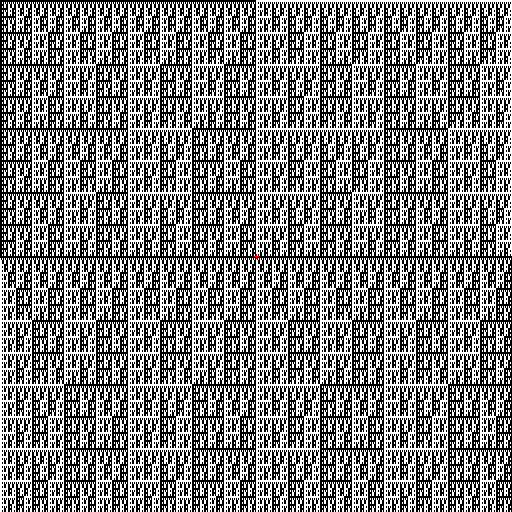

# Random program explorer

This is a program that I made a few years ago after I became interested in the concept of generating random programs.

## Overview

The idea is to generate a random function `f(x,y)` that takes two 64 bit integers `x,y` and returns another 64 bit integer. This function f(x,y) is generated by a python program that chooses random lines of C from a list (specifically, this is handled by the file `src/rangen_hack.py`) and randomly substituting either `x` or `y` into them.

## Features

- Highly configurable
  - Generating a program is handled in the python file `src/rangen_hack.py`, so it's easy to edit. 
  - You can edit the file `dynamic.c\ (template)` to change the template used by the random program generation code.
- Archiving/reloading generated programs
- Highly interactive
  - You can manually change `src/dynamic.c` during runtime with any text editor and the changes will be displayed "live."

## Controls
- Up/down arrow keys: change the number of steps in the program.
- Keypad minus: Capture a screenshot and save the current program.
- Keypad plus: Regenerate the program.
- 0 and 9: increment/decrement an integer `util` that is accessible inside `dynamic.c`.
- 7 and 8: increment/decrement an integer `util2` that is accessible inside `dynamic.c`.
- W, A, S and D: change the offset of `x` and `y`.
- [ and ]: Increment/decrement the bit of `f(x,y)` which is displayed (i.e., increment/decrement the variable `shift`.)
- R: Reset the offset, `shift` and `util` variables.

## Screenshots

There are many interesting screenshots (as well as their associated programs) included in the directory `./python_progs`.

## Compiling

You will have to compile this yourself. This project has only been tested on Linux.